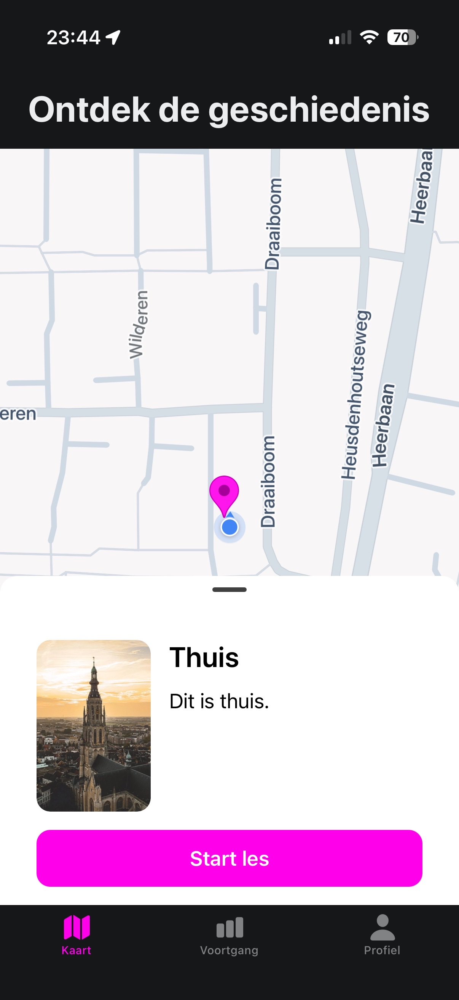
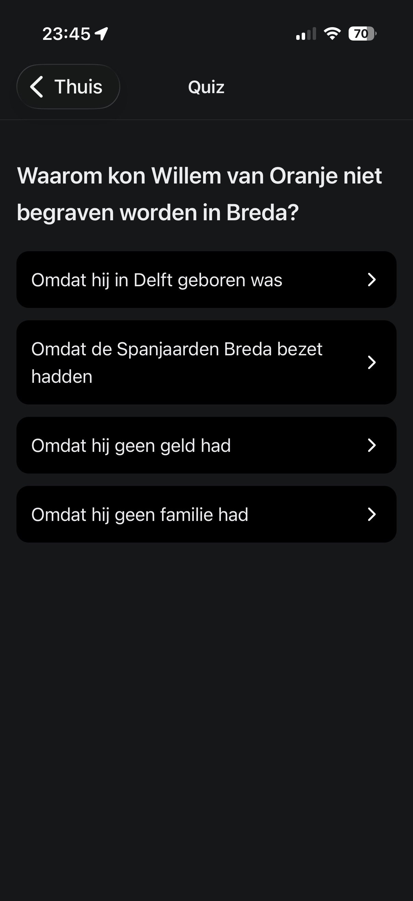

# MVP History
Ontdek historische locaties op een interactieve kaart door het volgen van mini lesjes.

## Over het project
HiStory is een Minimum Viable Product (MVP) waarmee gebruikers historische locaties kunnen verkennen op een interactieve kaart. 
Elke locatie wordt weergegeven met een marker. Je moet er heen lopen om vervolgens de mini class te starten.

Het doel van dit MVP is om snel te valideren of gebruikers interesse hebben in het ontdekken van geschiedenis op basis van locatie.

## Features
- Google Maps implementatie
- Mini lesjes volgen en opnieuw starten
- Feedback door middel van geluid
- Resetten van progressie

## Screenshots
<table>
  <tr>
    <td width="50%">
      
    </td>
    <td width="50%">
      
    </td>
  </tr>
   <tr>
    <td width="50%">
      
    </td>
    <td width="50%">
      
    </td>
  </tr>
</table>

## Technische Stack
- React Native met Expo
- Expo-Audio
- React-native-maps

## Installatie Guide

1. Installeer dependencies

   ```bash
   npm install
   ```

2. Start de applicatie

   ```bash
   npx expo start
   ```

## Join EXPO
- [Expo on GitHub](https://github.com/expo/expo): Bekijk het open source platform en neem deel.
- [Discord community](https://chat.expo.dev): Chat met Expo gebruikers en stel je vragen.

x WorldwideErrors // Jeffrey
